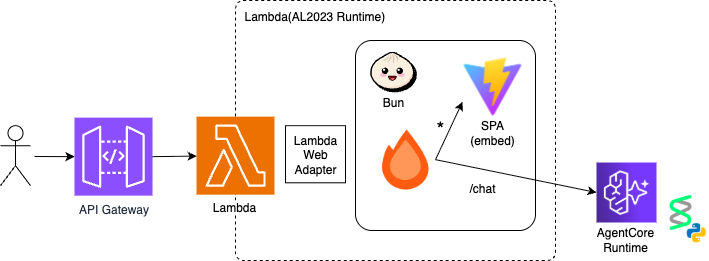

# agent-core-playground

## アーキテクチャ



## プロジェクト構成

```
apps/
  agent/   # Python エージェント (uv)
  server/  # API サーバー (Bun + Hono)
  spa/     # フロントエンド (React + Vite)
iac/       # CDK インフラ
```

## ローカル開発

```bash
bun install
bun dev
```

`.envrc`:

```bash
export AWS_REGION=ap-northeast-1
export AGENT_RUNTIME_ARN_SSM_PARAM=/dev/agent-core-playground/agent-core/runtime-arn
```

## デプロイ

`MainStack  # AgentCore + WebApp (APIGatway + Lambda) `

### デプロイ

```bash
bun run deploy
```

### Hotswap デプロイ（高速）

Lambda関数などを直接更新する高速デプロイ:

```bash
bun run deploy:hotswap
```

## 命名規則

- スタック: `{stageName.short}-{projectName.short}-{stackType}` (例: `d-acp-main`)
- SSMパラメータ: `/{stageName}/{projectName}/xxx`
